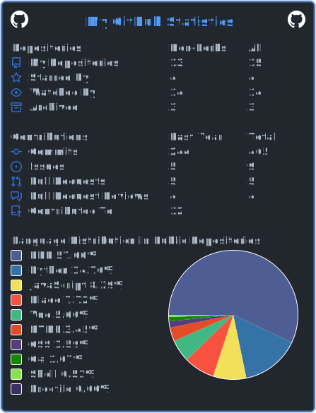

<h1 align="center">Hi 👋, I'm Bishow Bhattarai</h1>
<h3 align="center">A passionate IT student for programming, cybersecurity & stuff like that</h3>

- 🔭 I’m currently working on [thehackingtips](https://thehackingtips.com)

- 🌱 I’m currently learning **Laravel, NodeJS, Flutter, C++**

- 👯 I’m looking to collaborate on **anything**

- 👨‍💻 My personal website [https://www.officialbishowb.com/](https://www.officialbishowb.com/)

<h3 align="left">Connect with me:</h3>

<h3 align="left">Languages and Tools:</h3>

                        

&nbsp;

